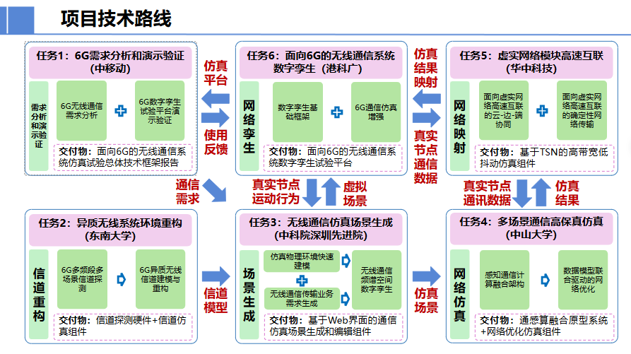

# 面向6G的无线通信系统仿真试验平台​

## 文件目录

```
6G-Twin-simulation-system
├─api_document
└─models
    ├─channel-simulator
    ├─digital-twin-platform
    ├─ICSC-prototype-system
    ├─network-optimizer
    ├─scene-generator
    ├─Technical-framework-report
    └─tsn-simulator
```

按照任务交付物分为了7个文件夹，对应关系如下：

1. `channel-simulator` 信道仿真组件​（东南大学）
2. `digital-twin-platform` 面向6G的无线通信系统数字孪生试验平台（港科广）
3. `tsn-simulator` 基于TSN的高带宽低抖动仿真组件（华中科技）
4. `network-optimizer` 网络优化仿真组件​（中山大学）
5. `​​ICSC-prototype-system` 通感算融合原型系统（中山大学）
6. `Technical framework report` 面向6G的无线通信系统仿真试验总体技术框架报告（中移动）
7. `scene-generator` 基于Web界面的通信仿真场景生成和编辑组件（中科院深圳先进院）


